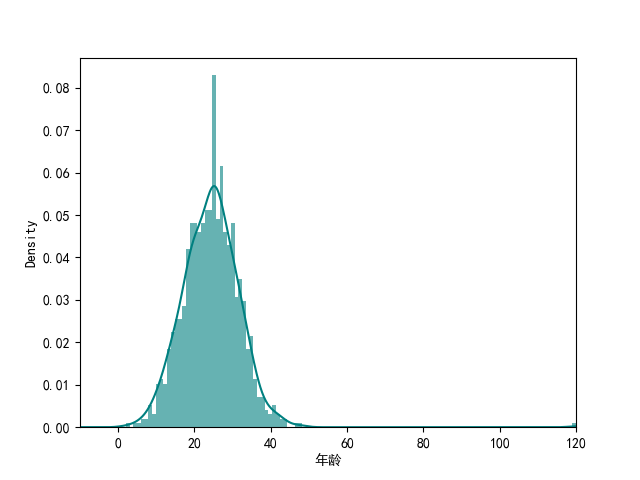
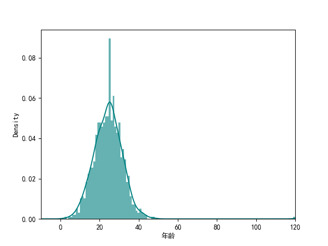
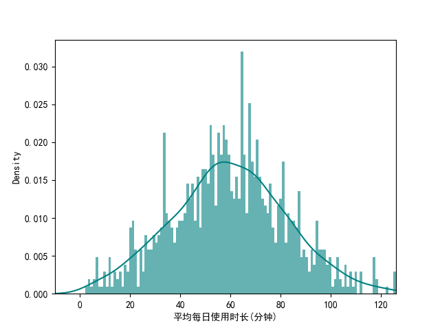
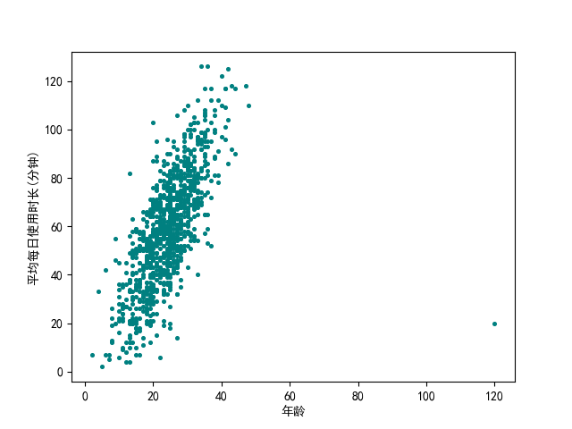
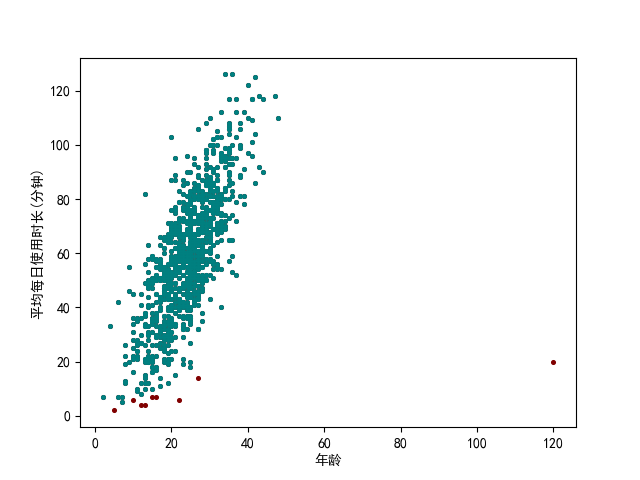
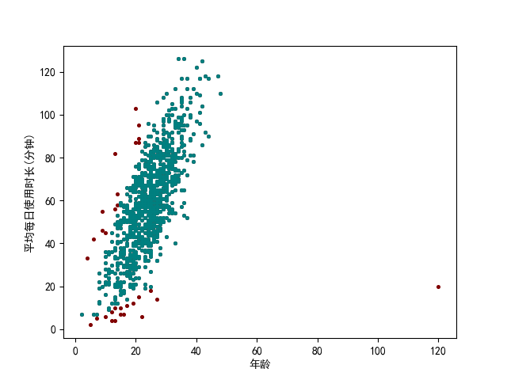

# 数据科学导论 - 作业 1

姓名：郑东森   班级：计23   学号：2022010799

[toc]

# 第一题 - 采样

## 假设

- 在本次采样中，我们的目标是分析用户属性与其观看的视频的相关性。
- 在本次采样中，只有两类点——视频和用户，以及一类边——用户行为。
- 在本次采样中，我们可以进行以下合法操作：
  1. 遍历一个不知道大小的影片点集
  2. 遍历一个不知道大小的用户点集
  3. 输入某个点的位址，获得一个内存可接受的邻居点集并知道边的属性
- 影片创作者有加标签，标明影片的特点

## 算法主体

   STEP 1. 根据蓄水池算法对影片进行随机采样。

   STEP 2. 对具有相同的标签的影片建边，建立一张新图

   STEP 3. 用 Louvain 算法把影片进行聚类，分成不同类型

   STEP 4. 遍历图，定下合适的比例 x%，保证可以将与目前图的点相连的点的属性的 x% 输入内存

   STEP 5. 对于每一个影片类型，随机采样 x% 的用户点集

   STEP 6. (验证) 把上述的影片替换成用户，影片标签替换为用户属性重新计算 STEP 1-5 检验分析结果是否相似

## 算法优点

1. 算法在一定程度上保证了度的分布
2. 算法大程度下保证了点数量的比例
3. 算法保证了数据的随机性
4. 算法提供了一定验证能力

## 算法缺点

1. 并不适用所有数据分析，适用场景较单一
2. 不保证边属性的分布

# 第二题 - 相关分析

整体清洗方法使用 python 实现，调用了以下库，并进行了以下初始化

```python
import numpy as np
import pandas as pd
import matplotlib.pyplot as plt
import re

plt.rcParams["font.sans-serif"]=["SimHei"] 
plt.rcParams["axes.unicode_minus"]=False
# 使得图表可以正确显示中文

df = pd.read_csv('./user_data.csv')
```

## 初步清洗

首先将所有非纯数字的点设为空：

```python
def check_num(x):
    if pd.isnull(x):
        return np.nan
    elif re.fullmatch(r'\d+|\d+岁',x) is None:
        # 发现存在一组数据为 ‘36岁’ 故特判以下
        return np.nan
    elif re.fullmatch(r'\d+',x) is None:
        return int(x[:-1])
    else:
        return int(x)

df = df.applymap(check_num)
```

由于人类最长寿命为 $122$ 岁（让娜·卡尔芒）故将大于 $122$ 岁和小于 $0$ 岁的年龄设为 nan ；由于一天时间最长为 $24\times 60$ 分，故将所有大于 $24\times 60$ 和小于 $0$ 的时间设为 nan

```python
def age_check_legal(x):
    if pd.isnull(x):
        return np.nan
    elif x<=0 or x>125:
        return np.nan
    else:
        return x

def time_check_legal(x):
    if pd.isnull(x):
        return np.nan
    elif x<0 or x>24*60:
        return np.nan
    else:
        return x

df['年龄'] = df['年龄'].apply(age_check_legal)
df['平均每日使用时长(分钟)'] = df['平均每日使用时长(分钟)'].apply(time_check_legal)
```

## 数据填补

### 年龄

```python
print(f'nan in age is {df["年龄"].isnull().sum()/df["年龄"].size}%')
# nan in age is 0.007%

df['年龄'].hist(bins = 120, stacked = True, density = True, alpha = 0.6, color = 'teal')
df['年龄'].plot(kind = 'density', color = 'teal')
plt.xlim(-10,120)
plt.xlabel('年龄')
plt.show()print
```



观察数据发现年龄呈正态分布，且缺失数据较少，可以直接用中位数进行填补。

```python
age_median = np.median(df['年龄'].dropna())

def age_fill(x):
    if pd.isnull(x):
        return age_median
    else:
        return x

print(f'median of age is {age_median}')
# median of age is 25.0
df['年龄'] = df['年龄'].apply(age_fill)
```

```python
df['年龄'].hist(bins = 120, stacked = True, density = True, alpha = 0.6, color = 'teal')
df['年龄'].plot(kind = 'density', color = 'teal')
plt.xlim(-10,120)
plt.xlabel('年龄')
plt.show()
```



### 平均每日使用时长(分钟)

```python
print(f'nan in time is {df["平均每日使用时长(分钟)"].isnull().sum()/df["平均每日使用时长(分钟)"].size}%')
# nan in time is 0.007%

df['平均每日使用时长(分钟)'].hist(bins = 120, stacked = True, density = True, alpha = 0.6, color = 'teal')
df['平均每日使用时长(分钟)'].plot(kind = 'density', color = 'teal')
plt.xlim(-10,126)
plt.xlabel('平均每日使用时长(分钟)')
plt.show()
```


观察数据发现时间也呈正态分布，且缺失数据较少，可以直接用中位数进行填补。

```python
time_median = np.median(df['平均每日使用时长(分钟)'])

def time_fill(x):
    if pd.isnull(x):
        return time_median
    else:
        return x

print(f'median of age is {time_median}')
median of age is 59.0
df['平均每日使用时长(分钟)'] = df['平均每日使用时长(分钟)'].apply(time_fill)
```

```python
df['平均每日使用时长(分钟)'].hist(bins = 120, stacked = True, density = True, alpha = 0.6, color = 'teal')
df['平均每日使用时长(分钟)'].plot(kind = 'density', color = 'teal')
plt.xlim(-10,126)
plt.xlabel('平均每日使用时长(分钟)')
plt.show()
```



## 观察填补数据

```python
plt.scatter(df['年龄'],df['平均每日使用时长(分钟)'],s=7,c='teal')
plt.show()
```



观察上散点图，发现存在离群点，且数据呈较强线性关系，尝试去除离群点后使用 Pearson 系数分析相关性。

## 去除离散点

尝试两种不同的剔除离散点的方法。

### Zscore 方法

```python
def outliers_Zscore(data):
    avg = np.mean(data)
    std = np.std(data)
    Zsocre = np.abs((data-avg)/data)
    return data[Zsocre > 3].index

df['temp'] = df['平均每日使用时长(分钟)']/df['年龄']
df_Zscore = df.drop(outliers_Zscore(df['temp']))

print(f'left {df_Zscore.size//3} pairs of data')
print(f'pearson = {df_Zscore.corr()["年龄"]["平均每日使用时长(分钟)"]}')
# left 991 pairs of data
# pearson = 0.7615906197145329

# 红色为离群点
plt.scatter(df['年龄'],df['平均每日使用时长(分钟)'],s=7,c='maroon')
plt.scatter(df_Zscore['年龄'],df_Zscore['平均每日使用时长(分钟)'],s=7,c='teal')
plt.ylabel('平均每日使用时长(分钟)')
plt.xlabel('年龄')
plt.show()
```



Zscore 方法剩下了 $991$ 组数据，得出 pearson 系数为 $0.7615906197145329$, 说明数据呈较强正相关关系。

### IQR 方法

```python
def outliers_IQR(data):
    q1, q3 = np.quantile(data, [0.25, 0.75])
    iqr = q3 - q1
    lower, upper = q1 - 1.5 * iqr, q3 + 1.5 * iqr
    return data[(data < lower) | (data > upper)].index

df_IQR = df.drop(outliers_IQR(df['temp']))

print(f'left {df_IQR.size//3} pairs of data')
print(f'pearson = {df_IQR.corr()["年龄"]["平均每日使用时长(分钟)"]}')
#left 969 pairs of data
#pearson = 0.7792382078305893

# 红色为离群点
plt.scatter(df['年龄'],df['平均每日使用时长(分钟)'],s=7,c='maroon')
plt.scatter(df_IQR['年龄'],df_IQR['平均每日使用时长(分钟)'],s=7,c='teal')
plt.ylabel('平均每日使用时长(分钟)')
plt.xlabel('年龄')
plt.show()
```



IQR 方法剩下了 $969$ 组数据，得出 pearson 系数为 $0.7792382078305893$, 也说明了数据呈较强正相关关系。

## 结论

无论 Zsocre 方法还是 IQR 方法都得出了数据呈较强正相关关系的结论，故年龄和平均每日使用时长呈较强正相关关系。

# （可选题）逻辑回归

## 数据清洗&填补

首先作者他对 train 数据分析了下哪些数据有空，发现年龄、客舱号、上船地点都有空缺，尝试填补

### 年龄

年龄有 20% 左右的数据缺失，且棒状图呈右倾，所以作者用了中位数对缺失数据进行了填补。

### 客舱号

客舱号有 77% 左右的数据缺失，作者认为缺失过多不可以进行填补。

### 上船地点

上船地点只有 0.22% 左右数据缺失，故作者直接用最多出现的上船地点进行填补。

### 是否单独旅行

由于数据中 SibSp 和 Parch 数据都与是否单独旅行相关，于是作者加了一行相关数据：“是否单独旅行”来代替 SibSp 和 Parch

---

对 test 数据进行同样操作，发先 test 数据中 Fare 数据也有空缺：

### 费用

test 数据中 Fare 数据只有一个值空缺，作者直接了使用中位数进行填补。

## 探索性数据分析

### 年龄

作者观察发现再年龄分布上，幸存者和遇难者的组成是非常相似的，唯一的不同在于未成年部分。

将未成年人的生存率用图表表示后发现未成年人的生存率十分高，说明当时的乘客是有做过尝试去拯救未成年人生命的。

因此，作者也增加了一个新的变量：“IsMinor”——是否为未成年人（是否小于等于 16 岁）

### 船票费用

床票费用上，作者发现图表显著表现出了付出更少船费的人遇难概率更高。说明这会成为最终分析中的一个重要数据。

### 舱位等级

图表中显著表现出更高的舱位等级会带来更高的生存概率。

### 上船地点

观察发现再 Cherbourg 上船的生存概率更高，Queenstown 其次，Southhampton 最低。作者分析认为这可能与舱位等级或房间位置选择有关系。

除了单纯看柱状图，柱状图上的 whiskers 也值得注意，它说明了由于 Queenstown 即使总体生存概率更高，但由于登船人数更少，信赖区间更大，比 Southhampton 的人更加命运多舛一点。

### 是否独自旅行

独自旅行的人更容易遇难。

### 性别

性别与生存概率的关系非常明显，女性的生存概率显然更高。

## 逻辑回归与结果

### 变量选择

- **Recursive feature elimination (RFE)**
  通过外部的估值器对特征重要性进行赋值，再递归地消元到指定的特征数量。
- **Feature ranking with recursive feature elimination and cross-validation (RFECV)**
  通过交叉验证的方式验证 RFE 所使用的特征数量还需不需要减少。

作者先使用 RFE 方法将低权重变量剔除，再用 RFECV 验证了自己的结果。

### 评估模型

作者首先回顾了下不同的想法：

1. **训练数据和测试数据为同一组**
   这样的话若最大话训练准确度会使模型过于趋近于训练数据。
2. **把数据分成训练数据和测试数据两部分**
   测试准确度会比训练准确度更适合对未知的数据进行操作，但与此同时这个方法也是不稳定的。

由于该比赛是要对未知数据进行操作，故作者认为将数据分成训练数据和测试数据更好一点。

1. **ROC 曲线**
   对于每个阈值计算相对应的真正类率以及负正类率，绘制相关曲线，曲线以下的面积越大说明模型准确率越高。
2. **K-fold 交叉验证**
   把训练数据分为 $K$ 组，每次取 $1$ 组做验证集，$K-1$ 组做训练集，最后将误差加和平均计算交叉验证误差。

作者分别通过 ROC 曲线，K-fold 交叉验证 ( 在 sklearn 对应 cross_val_score() 和 cross_validate() 两个函数 ) 对模型进行评估，模型准确率都有 0.8 左右。

过程中，作者尝试加入 'Fare' 变量，发现模型变差了，故取消加入。

### 网格搜索法

- **网格搜索法**
  遍历所有参数组合来优化模型的方法

作者使用了在评估模型时使用的评分方式来进行搜索建立逻辑回归要用的 params 最终拟合出模型。
