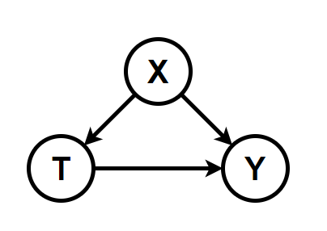

# 数据科学导论 - 作业 2

姓名：郑东森   班级：计23   学号：2022010799

[toc]

# 第一题 - 因果分析

选择模型：Counterfactial Model

## 主要思想

Counterfactial Model 的主要思想在于提供了一个公式：

$$
\delta = Y_i(1)-Y_i(0)
$$

其中 $Y_i(1):=Y|_{do(T=1)}$ 并不是治疗 1 发生的概率

来对计算 causal effect ，从而对因果关系的程度进行计算。

在这个模型中，我们称已经实现并能观察到结果的称为 Factual，而不能被观测的称为 Counterfactual。

就像吃完药你不能观测到没吃药的人的结果，你不可能同时计算出对于同一个个体不同 "治疗" 下的状况（ ITE : Individual treatment effect) ，于是引入了期望值来计算 ATE ( Average treatment effect ) ：

$$
E[\delta]=E[Y(1)-Y(0)]=E[Y(1)]-E[Y(0)]
$$

这里可以通过 Unconfoundedness 的假设或 RCT (Randomized control trial) 来使得 treatment 与 outcome 没有 confounding association 从而从把上面的式子从 causal quantity 转换成 statistical quantity ，使得 $\delta$ 可以计算 。

$$
\begin{align*}
E[Y(1)-Y(0)] &=E_XE[Y(1)-Y(0)|X]\\
& =E_XE[Y|T=1,X]-E[Y|T=0,X]] \\
\end{align*}
$$

---

Counterfactial Model 主要是解决了很多存在 confounding association 而使得统计学结果失真的情况（如著名的辛普森悖论），提供了一种可量化的因果性模型。

## 应用

假设用户点击广告（Y）的原因由用户观看的视频（T）和用户本身因素（X）决定；用户本身因素没有 causal parents；而用户观看的视频由用户本身因素决定：



由于任务中给与的是历史记录，故我们只可以使用 Unconfoundedness 假设

首先对各个因素进行细分：

### 用户本身因素 X

我们把用户本身因素分成：

1. 年龄 ( $x_1$ )
   再以年龄细分各个年龄段 ( $x_{1,j}$ )
2. 地域 ( $x_2$ )
   每个地域分别为 $x_{2,j}$
3. 使用产品时间 ( $x_3$ )
   再以加以细分为各个等级 ( $x_{3,j}$ )

### 用户观看的视频（T）

可以通过聚类算法或标签将视频分成不同类型，列为 $T_i$

### 用户点击广告（Y）

与视频一样，可以通过聚类算法或标签将广告分成不同类型，列为 $Y_i$

### X 对 Y 的 causal effect

由于 $X$ 没有 causal parents 所以这里的 $E[\delta]$ 是具有 identifiability 的，可以直接转化 Causal quantity 为 Statistical quantity ：

$$
\begin{align*}
E[\delta] &=E[Y_i(x_{i,j})-Y_i(0)]\\
&=E[Y_i|X=x_{i,j}]-E[Y_i|X=0]
\end{align*}
$$

于是我们就可以通过数据计算期望值来对用户点击广告所受到用户本身因素而造成的 Causal effect 进行计算，从而筛选出重要的因素。之后可以根据用户本身因素推送更高纪律被点击的广告。

### T 对 Y 的 causal effect

$T$ 有 causal parent $X$ 所以需要进行 Unconfoundedness 假设，所以这里的 sufficient adjustment set 是 X，根据 The Adjustment Formula 有：

$$
\begin{align*}
E[\delta]&=E_XE[Y_i(T_i)-Y_i(0)]\\
&=E_X[ E[Y_i|T=T_i]-E[Y_i|T=0] ]
\end{align*}
$$

于是我们就可以通过数据计算期望值来对用户点击广告所受到用户观看的视频造成的 Causal effect 进行计算，从而筛选出重要的因素。之后可以通过改变推送的视频来使得接下来的广告更有可能被点击，或根据用户观看的视频来决定要推送哪一个广告。

# (可选题) 关联分析

先放答案，后面有代码（Python）解释

## 答案部分

所有频繁项集（最小支持度为 $0.6$ ）：

```
1 ( E ) sup = 0.8
2 ( K ) sup = 1.0
3 ( M ) sup = 0.6
4 ( O ) sup = 0.6
5 ( Y ) sup = 0.6
6 ( K, E ) sup = 0.8
7 ( E, O ) sup = 0.6
8 ( K, M ) sup = 0.6
9 ( K, O ) sup = 0.6
10 ( K, Y ) sup = 0.6
11 ( K, E, O ) sup = 0.6
```

所有满足（Buys(item1) AND Buys(item2) ==> Buys(item3)）强关联规则如下（最小置信度为0.8）：

```
Buy( E ) and Buy( K ) -> Buy( O )
```

## 代码部分

### 预处理

```python
# 将支持度转化为出现次数
minsup = int(len(rawData) * rawminsup)
# 将 Data 中的每个订单转化成 set 形式
Data = []
for Tid in rawData:
    Temp = set()
    for item in Tid:
        Temp.add(item)
    Temp = sorted(Temp)
    Data.append(Temp)
Data = sorted(Data)
# 建立集合 D 表示所有货物集合
D = set()
for Tid in rawData:
    for item in Tid:
        D.add(item)
D = sorted(D)
# 手动生成 C1
C1 = []
for item in D:
    C1.append({item})
C1 = map(frozenset, C1)
# 生成 L1, 并建立 L 集合
L1, supans = GenL(Data, C1, minsup)
L = [L1]
```

### 生成 Lk （即长度为 k 的频繁项集）

```python
def GenL(Data, C, minsup, ans={}):
    L = []
    # 由于 C 已经是剪枝过的，所以不需要特别处理
    for itemset in C:
        sup = 0
        for Tid in Data:
            if itemset.issubset(Tid):
                sup += 1
        if sup >= minsup:
            ans[itemset] = sup
            L.append(itemset)
    # 返回 L, 顺便更新总频繁项集 ans
    return L, ans
```

### 生成 Ck（即长度为 k 的候选集合）

```python
def GenC(L):
    '''
    关于这里剪枝的理解：
    令这里将要生成的集合为 A = {a1, a2 ... ak-1, ak}
    由于这个剪枝的性质，以下集合 
    B = {a1, a2 ... ak-2, ak-1}
    C = {a1, a2 ... ak-2, ak}
    必定都没有被剪枝，否则 A 就是 B 或 C 的子孙节点
    于是 A 必定能被生成。
    为了不重复生成 A 可以将 B 和 C 定义为上述形式，
    这样 (B, C) 就唯一了
    '''
    C = []
    Llen = len(L)
    for i in range(Llen):
        for j in range(i+1, Llen):
            L1 = list(L[i]); L2 = list(L[j])
            L1.sort(), L2.sort()
            flag = True
            for i in range(len(L1)-1):
                if L1[i] != L2[i]:
                    flag = False
                    break
            if flag:
                C.append(sorted(L[i] | L[j]))
    C.sort()
    return map(frozenset, C)
```

### Apriori 算法主体

```python
for k in range(2, len(rawData)+1):
    # 利用 L(k-1) 来生成下一个 Ck
    Ck = GenC(L[k-2])
    Lk, supans = GenL(Data, Ck, minsup)
    L.append(Lk)
```

### 找强关联规则

```python
def GenRules(supdata, minconf):
    '''
    由于题目只要找形如
    buy(a) & buy(b) => buy(c)
    的强关联规则
    故我们只需要对大小为 3 的集合进行查找即可
    '''
    for comb in supdata:  
        if len(comb) >3:
            break
        if len(comb)!=3:
            continue
        for item3 in comb:
            conf = supdata[comb]/supdata[frozenset(item3)]
            if conf >= minconf:
                Temp = comb - {item3}
                print(f'Buy( {min(Temp)} ) and Buy( {max(Temp)} ) -> Buy( {item3} )')

```

## 完整代码（附）

```python
def GenC(L):
    '''
    关于这里剪枝的理解：
    令这里将要生成的集合为 A = {a1, a2 ... ak-1, ak}
    由于这个剪枝的性质，以下集合 
    B = {a1, a2 ... ak-2, ak-1}
    C = {a1, a2 ... ak-2, ak}
    必定都没有被剪枝，否则 A 就是 B 或 C 的子孙节点
    于是 A 必定能被生成。
    为了不重复生成 A 可以将 B 和 C 定义为上述形式，
    这样 (B, C) 就唯一了
    '''
    C = []
    Llen = len(L)
    for i in range(Llen):
        for j in range(i+1, Llen):
            L1 = list(L[i]); L2 = list(L[j])
            L1.sort(), L2.sort()
            flag = True
            for i in range(len(L1)-1):
                if L1[i] != L2[i]:
                    flag = False
                    break
            if flag:
                C.append(sorted(L[i] | L[j]))
    C.sort()
    return map(frozenset, C)


def GenL(Data, C, minsup, ans={}):
    L = []
    # 由于 C 已经是剪枝过的，所以不需要特别处理
    for itemset in C:
        sup = 0
        for Tid in Data:
            if itemset.issubset(Tid):
                sup += 1
        if sup >= minsup:
            ans[itemset] = sup
            L.append(itemset)
    # 返回 L, 顺便更新总频繁项集 ans
    return L, ans

def GenRules(supdata, minconf):
    '''
    由于题目只要找形如
    buy(a) & buy(b) => buy(c)
    的强关联规则
    故我们只需要对大小为 3 的集合进行查找即可
    '''
    for comb in supdata:  
        if len(comb) >3:
            break
        if len(comb)!=3:
            continue
        for item3 in comb:
            conf = supdata[comb]/supdata[frozenset(item3)]
            if conf >= minconf:
                Temp = comb - {item3}
                print(f'Buy( {min(Temp)} ) and Buy( {max(Temp)} ) -> Buy( {item3} )')

def Apriori(rawData, rawminsup, minconf):
    # 将支持度转化为出现次数
    minsup = int(len(rawData) * rawminsup) 
    # 将 Data 中的每个订单转化成 set 形式
    for Tid in rawData:
        Temp = set()
        for item in Tid:
            Temp.add(item)
        Temp = sorted(Temp)
        Data.append(Temp)
    Data = sorted(Data)
    # 建立集合 D 表示所有货物集合
    D = set()
    for Tid in rawData:
        for item in Tid:
            D.add(item)
    D = sorted(D)
    # 手动生成 C1
    C1 = []
    for item in D:
        C1.append({item})
    C1 = map(frozenset, C1)
    # 生成 L1, 并建立 L 集合
    L1, supans = GenL(Data, C1, minsup)
    L = [L1]

    for k in range(2, len(rawData)+1):
        # 利用 L(k-1) 来生成下一个 Ck
        Ck = GenC(L[k-2])
        Lk, supans = GenL(Data, Ck, minsup)
        L.append(Lk)

    id = 0
    for comb in supans:
        id += 1
        print(f'{id} ( ', end='')
        Temp = 0
        for item in comb:
            Temp += 1
            if Temp == 1:
                print(f'{item}', end='')
                continue
            print(f', {item}', end='')
        print(f' ) sup = {supans[comb]/len(Data)}')
  
    GenRules(supans, minconf)

def main():

    Data = [['M', 'O', 'N', 'K', 'E', 'Y'],
            ['D', 'O', 'N', 'K', 'E', 'Y'],
            ['M', 'A', 'K', 'E'],
            ['M', 'U', 'C', 'K', 'Y'],
            ['C', 'O', 'O', 'K', 'I', 'E']]

    minsup = 0.6
    minconf = 0.8

    Apriori(Data, minsup, minconf)


if __name__ == '__main__':
    main()

```
