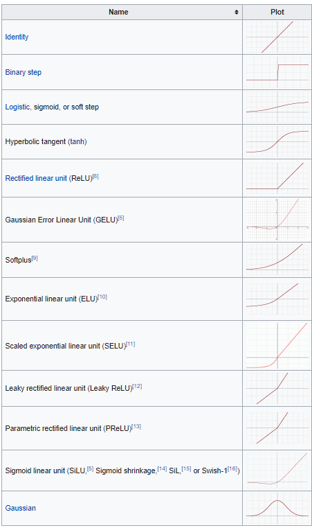
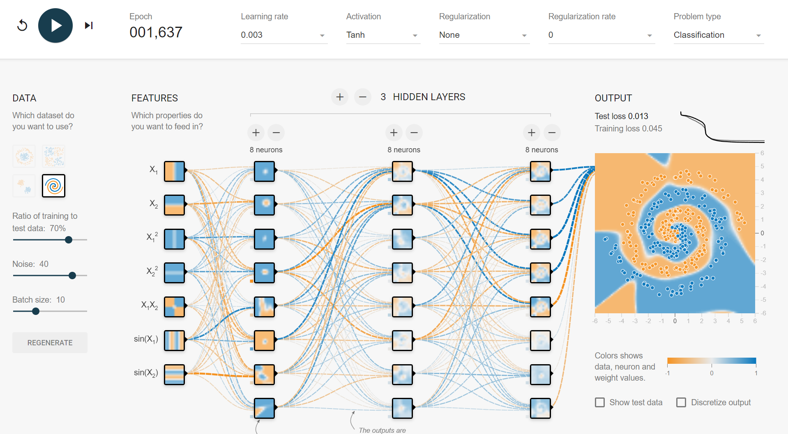
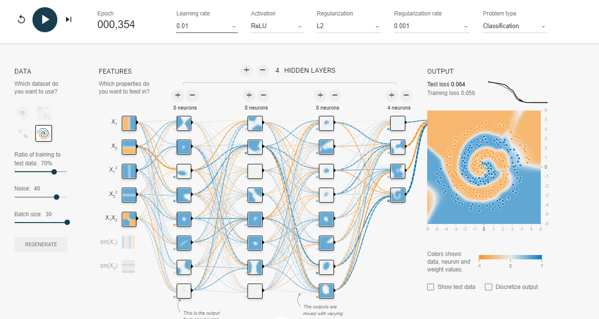

# 数据科学导论 - 作业 3

姓名：郑东森   班级：计23   学号：2022010799

[toc]

# 第一题 - 机器学习

## 1. 三种学习范式的异同

* **监督学习**：基于有标签训练数据进行的学习。学习任务是去给新数据贴标签（分类）或对新数据预测数值（回归）。
* **无监督学习**：基于没有标签的数据进行的学习。学习任务是生成“未知的标签”（特征）来对数据进行分类（聚类）。
* **半监督学习**：基于部分有标签，大多数没有标签的数据进行的学习。可以做监督学习和无监督学习的学习任务。

| 不同点               | 训练数据           | 学习目标         |
| -------------------- | ------------------ | ---------------- |
| **监督学习**   | 训练数据有标签     | 分类、回归       |
| **无监督学习** | 训练数据没有标签   | 聚类             |
| **半监督学习** | 训练数据部分有标签 | 分类、回归、聚类 |

**相同点**：基于数据进行学习。

## 2. 每种学习范式下的具体过程

### 监督学习

- 首先给与带有是否是 Spam 的邮件数据集
- 根据数据集分析存在某个词汇为垃圾邮件的后验概率 $P(Spam|Word)$
- 对不是垃圾邮件的数据进行分析计算出垃圾邮件的阈值。
- 利用朴素贝叶斯计算概率，根据之前的后验概率和阈值新的邮件进行预测，从而分析是否是垃圾邮件。

### 半监督学习

- 先对数据集合进行特征提取，并利用已有的分类模型进行检测分类
- 不断加入已经标签过的样本来训练分类器
- 重复以上过程，知道训练出较为可靠的垃圾邮件分类系统。

### 无监督学习

- 用聚类算法将部分数据进行初步聚类
- 对聚类后的结果人为贴上标签
- 在根据标签数据进行半监督学习

## 3. 哪种学习范式最好

若是在上面的例子里， 监督学习是最为准确的，无监督学习几乎不可能在非人为介入下进行垃圾邮件判断，从准确性考虑，监督学习是最优的。但现实生活中全部标好的数据往往是最为昂贵的。像是我之前就见到一个例子，若是要对一个图片进行像素级别的语义分析预处理，那么代价将是 $1.5$ 张/(人·天) 左右。所以我认为在未来的机器学习发展中，半监督学习将会成为主流，这也是我对于“哪种学习范式更好”的答案，半监督学习可以在保持可接受准确率的情况下最小化数据处理代价。

# 第二题 - 神经网络

## 1. 术语解析

- **Learning Rate**：调整神经网络输入权重的一种方法，如果感知机预测正确，则边权不变，否则变为 $\frac{d(loss)}{d(w)}\times Learning Rate$ 。直观表达就是感知机调整幅度的大小。
- **Activation**：深度学习基本原理是基于神经网络，让信号从一个神经元进入，经过**非线性**的 activation function 传递到下个神经元。如果不是非线性的化，会导致输入输出都是线性组合，也就是成为最基础的感知机，无法应用到非线性模型中。下图为常见的 activation function。
  
- **Regularization**：正则化，让某些参数失效从而防止模型过拟合。一般六分为 L1 正则化和 L2 正则化。
  L1 正则化：$costfunction=Loss+\lambda\sum||w||$
  L2 正则化：$costfunction=Loss+\lambda\sum||w||^2$
- **Regularization rate**：上式中的 $\lambda$
- **Hidden Layer**：神经网络层数
- **Neurons**：神经元数量
- **Batch size**：每次完整的正向和反向传播所使用的数据的数量，越大的 batch size 会让速度越快，但内存也会更大；而越小的 batch size 会让速度越慢，内存也会更小。
- **Epoch**：每一个 epoch 相当于把训练数据丢进神经网络一次。

## 2. 模型训练

## 3. 调参

### 调参顺序

activation function -> hidden layers -> neurons -> feature -> Learning Rate（过程中调）

### Activation Funciton

ReLU 下降得快很多，但最后拟合结果没有 Tanh 好。Sigmoid，Linear 在这里的效果不是很好。

### Learning Rate

学习率一般最开始设成 0.03 会好一些，不会太快就开始波动，也不会太慢，然后每当曲线趋于稳定的时候调小，直到 0.003，再小效果不大。

### Feature

Feture 只要 hidden layers 和 neurons 上去了对结果没有太大影响，就是对开头的速度有一些影响。

### hidden layers 和 neurons

hidden layers 和 neurons 不是越多越好，过多的 hidden layer 和 neurons 会导致过拟合等状况的发生。就如下图，可以看到 Test loss 在下降到一定程度后上升了，这就是很明显的过拟合特征。对于本组数据若用 Tanh 3 层每层 8 个神经元比较合适，若用 ReLU 4 层 8 8 8 4 比较合适。

### Batch size

Batch size 上去后拟合会稳定很多，这里不太需要考虑内存，可以直接 30
